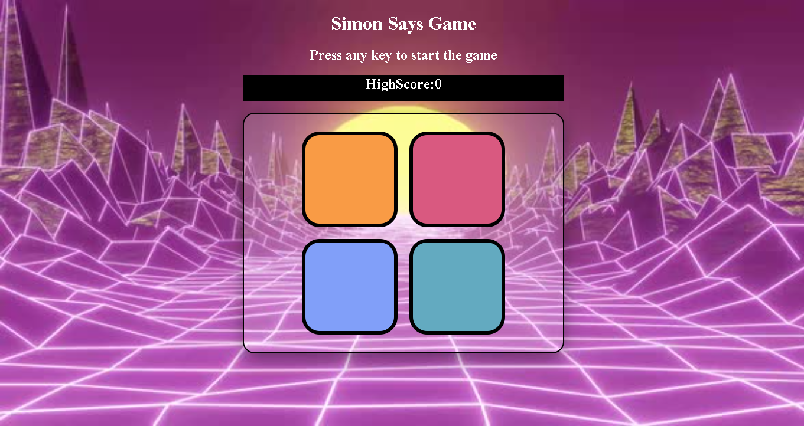
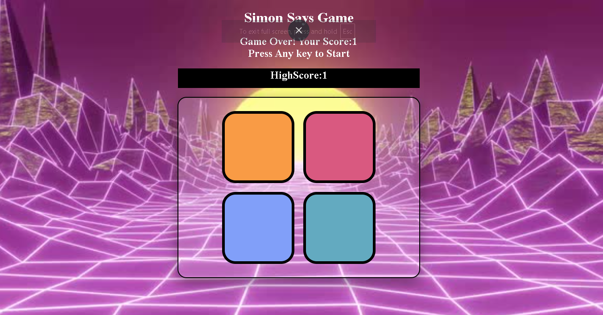

# 🎮 Simon Says Game

An interactive browser-based memory game inspired by the classic **Simon Says**. The game generates a random sequence of colors that the player must remember and repeat correctly. With every successful level, the sequence becomes longer, making the game progressively more challenging.

## 🚀 Features

* 🎲 Random color sequence generation
* 📈 Progressive difficulty with increasing levels
* 👆 Interactive button click detection
* ✨ Animated color flash effects
* ✅ Real-time answer validation
* 🏆 High score tracking during gameplay
* ❌ Game over animation and score display
* 🔄 Restart the game by pressing any key
* ⚡ Smooth gameplay using JavaScript event handling and timers

## 🛠️ Tech Stack

* HTML5
* CSS3
* JavaScript (ES6)

## 📂 Project Structure

```text
Simon-Says-Game/
├── images/
│   ├── game.png
│   ├── inline_image_preview.jpg
│   └── result.png
├── app.js
├── index.html
├── style.css
└── README.md
```

## 📚 Concepts Practiced

* DOM Manipulation
* Event Handling
* Arrays and Sequence Management
* Conditional Logic
* Functions
* Timers (`setTimeout`)
* Game State Management

## ▶️ How to Play

1. Press any key to start the game.
2. Watch the sequence of flashing colors carefully.
3. Repeat the sequence by clicking the colored buttons.
4. Every correct round adds one new color to the sequence.
5. A wrong click ends the game and displays your score.
6. Press any key to start a new game.

## 📸 Screenshot

  ## Game Start
  

  ## Game-Finished
  

## 💡 Future Improvements

* Add sound effects for each button
* Difficulty modes
* Save high score using Local Storage

## 👨‍💻 Author

**Aarav Srivastava**
